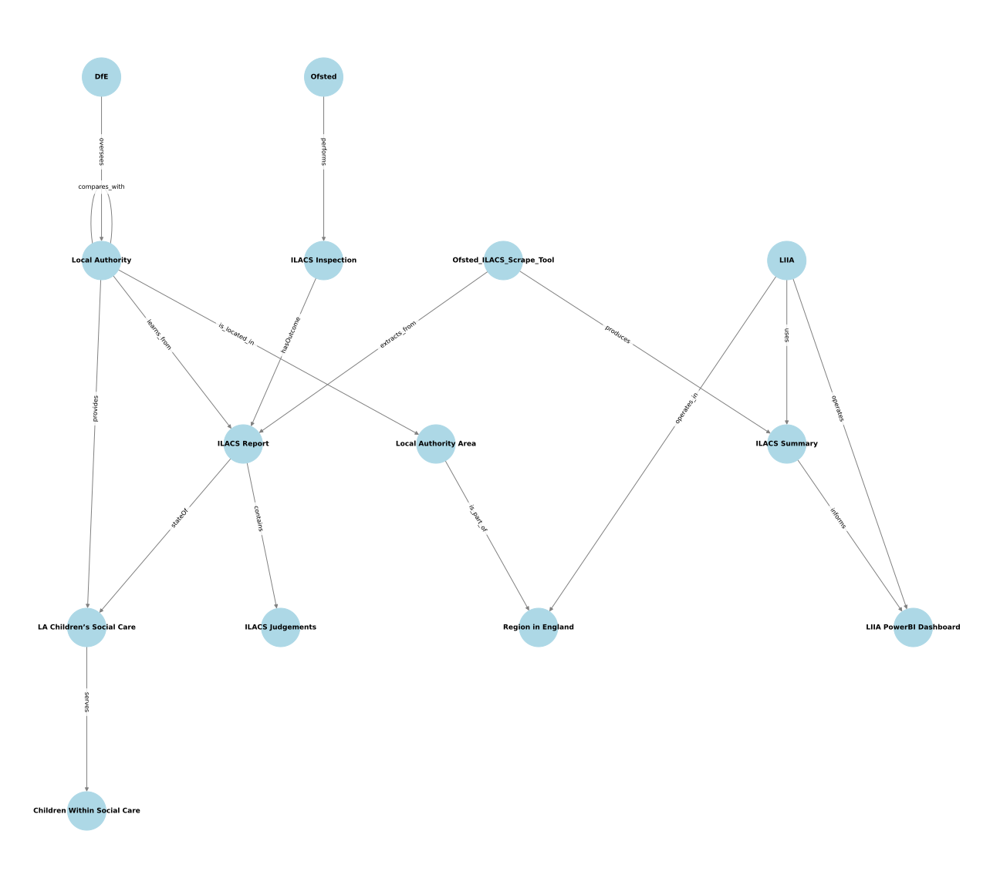

# Ofsted-ILACS-Scrape-Tool
On demand Ofsted ILACS results summary via inspection reports scrape from the Ofsted.gov pages  
Published: https://data-to-insight.github.io/ofsted-ilacs-scrape-tool/
-
### The inspection reports output summary is refreshed daily and timestamped for reference. 

## Initial problem brief
D2I and some local authorities use the ADCS published Ofsted ILACS inspections Excel summary as part of their internal data workflow(s). However the use of this data is restricted by the limited frequency that the summary sheet is (re-)published. Given that Ofsted inspection reports are published much more often(with an irregular publishing pattern), could we access the data/results directly ourselves and re-create a similar or more useful summary. Concurrently, are there also any other data elements that we could bring in to increase the potential use-cases for such a data summary. 

## Solution overview
This project is based on a proof-of-concept, 'can we do this' basis. As such it's supplied very much with the disclaimer of 'please check the vitals' if you're embedding it into something more critical, and likewise pls feel free to feedback into the project with suggestions. The structure of the code and processes have much scope for improvement, but some of the initial emphasis was on maintaining a level of code readability so that others might have an easier time of taking it further. That said, we needed to take some of the scrape/cleaning processes further than anticipated due to inconsistencies in the source site/data; this has ultimately impacted the intended 're-usable mvp' approach to codifying a solution for the original problem. 

The results structure and returned data is based almost entirely on the originating ILACS Summary produced/refreshed periodically by the ADCS; the use of which has previously underpinned several D2I projects. We're aware of several similar collections of longer-term work on and surrounding the Ofsted results theme, and would be happy to hear from those who perhaps also have bespoke ideas for changes here that would assist their own work. 

The scrape process is completed by running a single Python script: ofsted_ilacs_scrape.py

## Export(s)
There are currently three exports from the script. 
### Results HTML page
Generated (as ./index.html) to display a refreshed subset of the ILACS results summary. 

### Results Overview Summary
The complete ILACS overview spreadsheet, exported to the git project root ./ as an .xlsx file for ease and also accessible via a download link from the generated web-site results page (index.html)

### All CS inspections reports
During the scrape process, because we scan all the related CS inspection pdf reports for each LA; these can be/are packaged up into tidy LA named folders (urn_LAname) within the git repo (./export_data/inspection_reports/). There is a lot of data here, but if you download the entire export_data folder after the script has run, with the overview summary sheet then the local_inspection_reports column active links will work and you can then easily access each LA's previous reports all in once place via the supplied hyperlink(s). *Note:* This is currently not an option when viewing the results on the web page/Git Pages; but we are happy to clarify how to access/use this element if you get in touch. 

## Known Bugs
Some LA's inspection reports have PDF encoding or inconsistent data in the published reports that is causing extraction issues & null data. 
We're working to address these, these are:
- southend-on-sea, [overall, help_and_protection_grade,care_leavers_grade]
- nottingham, [inspection_framework, inspection_date]
- redcar and cleveland, [inspection_framework, inspection_date]
- knowsley, [inspector_name]
- stoke-on-trent, [inspector_name]

## Smart City Concept Model (SCCM)
The terminology and relations shown here might not be fully alligned with the SCCM standard(s), this is a work-in-progress. 
    

<strong>Key Entities</strong> (click to expand)

| Entity Label                                    | Type         | Description |
|------------------------------------------------|--------------|-------------|
| **Department for Education (DfE)**             | `ORGANIZATION` | UK government(body) overseeing children's services |
| **Ofsted**                                     | `ORGANIZATION` | Inspectors for children’s services(CSC) in England |
| **Local Authority**                            | `ORGANIZATION` | Responsible for children’s services delivery. Has unique `la_code` |
| **LA Children’s Social Care**                  | `SERVICE`      | Team within LA delivering social care services |
| **Children Within Social Care**                | `PERSON`       | Children receiving support from the CSC service |
| **ILACS Inspection**                     | `EVENT`        | Official Ofsted inspection of a local authority. Properties: `start_date`, `end_date`, `published_date` |
| **ILACS Judgement**                            | `OBSERVATION`  | Ofsted’s findings from an inspection. Properties: `judgement_type`, `judgement_grade` |
| **ILACS Inspection Summary**                   | `STATE`        | Summary of findings for a specific ILACS inspection event |
| **All ILACS Summary**                          | `COLLECTION`   | Combined ILACS inspections summaries(All LAs). Properties: `generated_date`, `version` |
| **ILACS Scraper Tool**                         | `METHOD`       | Python tool extracting inspection summaries(via Ofsted) into structured summary dataset |
| **London Innovation and Improvement Alliance (LIIA)** | `COMMUNITY` | Regional group using inspection data for (strategic) analysis |
| **LIIA Power BI Dashboards**                   | `FUNCTION`     | Dashboards built from the ILACS summary to inform regional |
| **Local Authority Area**                       | `PLACE`        | Geographic/admin area for each Local Authority |
| **Region in England**                          | `PLACE`        | Statistical/admin region made up of multiple Local Authorities |

---

<strong>Key Relationships</strong> (click to expand)

| Subject                          | Predicate         | Object                        |
|----------------------------------|-------------------|-------------------------------|
| `Department for Education`       | **oversees**      | `Ofsted`                      |
| `Local Authority`                | **is_located_in** | `Local Authority Area`        |
| `Local Authority Area`           | **is_part_of**    | `Region in England`           |
| `Local Authority`                | **provides**      | `LA Children’s Social Care`   |
| `LA Children’s Social Care`     | **serves**        | `Children Within Social Care` |
| `Ofsted`                         | **performs**      | `ILACS Inspection Event`      |
| `ILACS Inspection Event`         | **hasOutcome**    | `ILACS Inspection Summary`    |
| `ILACS Inspection Summary`       | **stateOf**       | `LA Children’s Social Care`   |
| `ILACS Inspection Event`         | **records**       | `ILACS Judgement`             |
| `ILACS Scraper Tool`            | **extracts_from** | `ILACS Inspection Summary`    |
| `ILACS Scraper Tool`            | **produces**      | `All ILACS Summary`           |
| `LIIA`                           | **uses**          | `All ILACS Summary`           |
| `All ILACS Summary`             | **informs**       | `LIIA Power BI Dashboards`    |
| `LIIA`                           | **operates**      | `LIIA Power BI Dashboards`    |
| `LIIA`                           | **defines**       | `Region in England`           |
| `LIIA`                           | **operates_in**   | `Region in England`           |
| `Local Authority`                | **compares_with** | `Local Authority`             |
| `Local Authority`                | **learns_from**   | `ILACS Inspection Summary`    |

---
References: [istanduk.org Initial SCCM Project](https://istanduk.org/projects/smart-cities-concept-model/) & [smartcityconceptmodel.com Smart Cities Concept Model](http://www.smartcityconceptmodel.com)      

## Imports(s)
There are currently two flat file(.csv) imports used. (/import_data/..)
### LA Lookup (/import_data/la_lookup/)
Allows us to add further LA related data including such as the historic LA codes still in use for some areas, but also enablers for further work, for example ONS region identifiers, and which CMS system LA's are using.
### Geospatial (/import_data/geospatial/)
This part of some ongoing work to access data we can use to enrich the Ofsted data with location based information, thus allowing us to visualise results on a map/choropleth. Some of the work towards this is completed, however because LA's geographical deliniations don't always map to ONS data, we're in the process of finding some work-arounds. The code and the reduced* GeoJSON data are there if anyone would like to fork the project and suggestion solutions. *GeoJSON data has been pre-processed to reduce the usually large file size and enable it within this repo/processing. 

## Future work
- We have started some early placeholder work on sentiment analysis of the inspection reports. At the moment, this is only shown in the Excel download summary (not on the web based summary to improve readability). The positive/negative sentiment within the inspection reports needs some further work developing both the thresholds and more detailed work on better understanding the report text. 

- Some of the in-progress efforts are included as a point of discuss or stepping stone for others to develop within the download .xlsx file. For example a set of columns detailing simplistic inspection sentiment analysis based on the language used in the most recent report (ref cols: sentiment_score, inspectors_median_sentiment_score, sentiment_summary, main_inspection_topics). *Note that the inclusion of these columns does not dictate that the scores are accurate, these additions are a starting point for discussion|suggestions and development!!*

- Geographical/Geospatial visualisations of results by region, la etc. are in progress. The basis for this is aready in place but some anomolies with how LA/counties boundary data is configured is an issue for some and thus the representation requires a bit more thought. 

- Improved automated workflow. We're currently still running the script manually until fixes can be applied to enable the Git Workflow(s) to run automatically/on a daily basis. We have the needed workflow scripts in place, but there is an ongoing issue in getting the py script to auto-run. Manual runs of the py script(+push/pull action) do correctly initiate the refresh of the html/GitPage.

- Provide active link access to all previous reports via the web front end. This currently only available when all post-script run files/folders are downloaded(this a v.large download if all LA folders included).

- Further development|bespoke work to improve potential tie-in with existing LA work that could use this tool or the resultant data. 

#### Contact via : datatoinsight.enquiries AT gmail.com

## Script admin notes
Simplified notes towards repo/script admin processes and enabling/instructions for non-admin running. 
### Script run intructions (User)
If looking to obtain a full instant refresh of the ilacs output, the ofsted_childrens_services_inspection_scrape.PY should be run. These instructions for running in the cloud/Github. 
- Create a new Codespace (on main)
- Type run the following bash script at Terminal prompt to set up './setup.sh'
- Run the script (can right click script file and select 'run in python....'
- Download the now refreshed ofsted_childrens_services_inspection_scrape.XLSX (Right click, download)
- Close codespace (Github will auto-remove unused spaces later)
  
### Run notes (Admin)
If you experience a permissions error running the setup bash file. 

/workspaces/ofsted-ilacs-scrape-tool (main) $ ./setup.sh
bash: ./setup.sh: Permission denied

then type the following, and try again: 
chmod +x setup.sh
